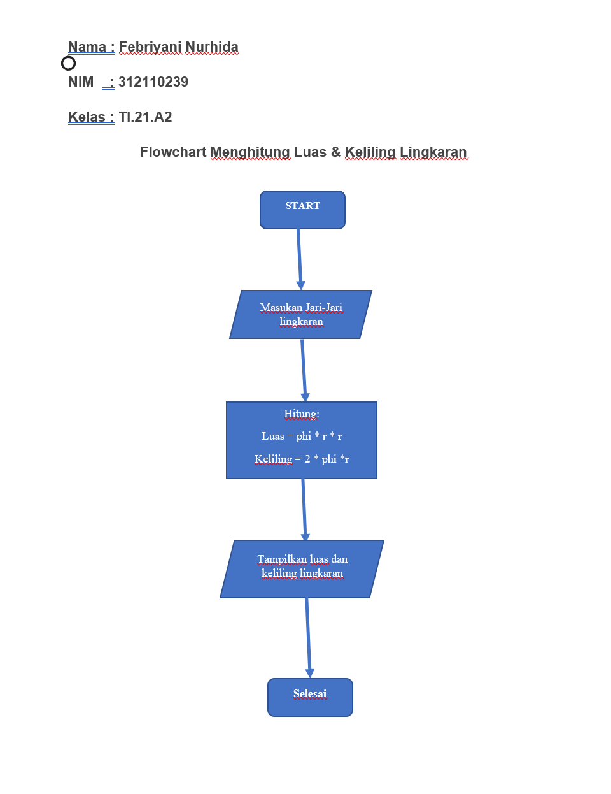
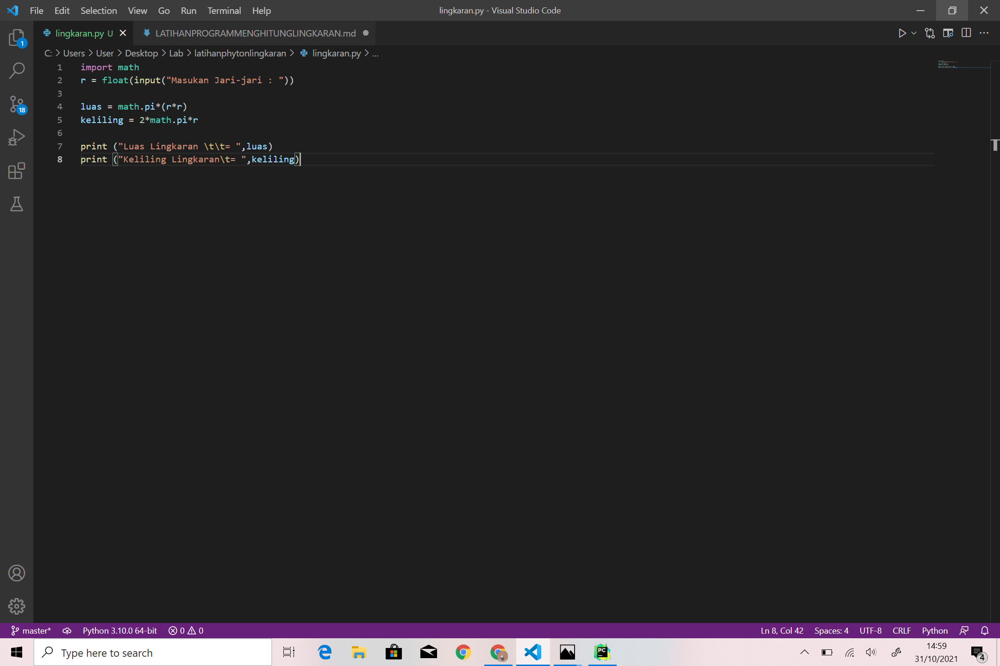
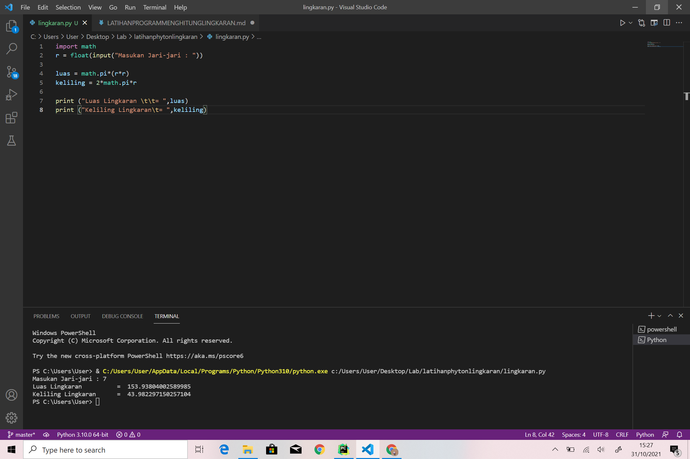
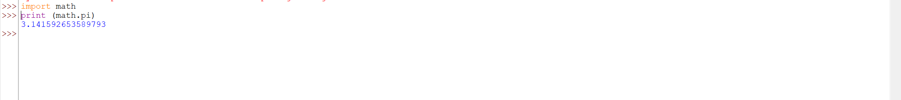
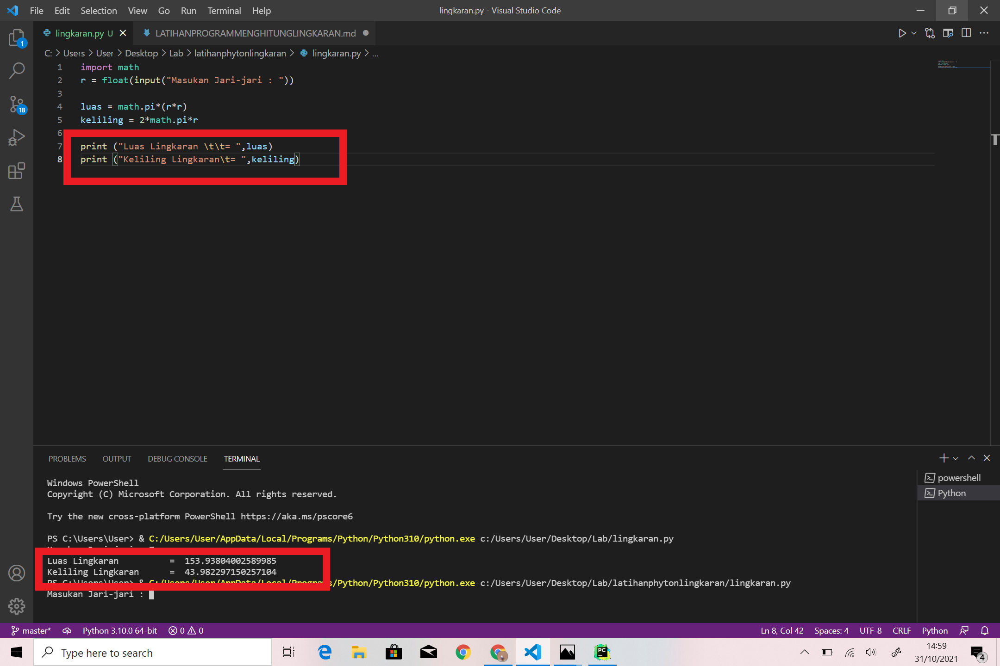

# Program Python Menghitung Luas & Keliling Lingkaran
Contoh program python untuk menghitung luas maupun kelilinng linkaran, kita cukup mengimplementasi rumus luas dan keliling lingkaran ke dalam program yang di buat.
## Rumus Luas & Keliling Lingkaran
Luas     = π × r²
Keliling = 2 x π × r
Nilai Phi yang akan kita gunakan adalah 3.14
r merupakan jari-jari lingkaran
Phi merupakan nilai konstanta di matematika sementara jari-jari merupakan jarak antara titik pusat dengan tepi lingkaran. Sebetulnya ada rumus lain untuk menghitung keliling lingkaran yaitu dengan menggunakan diameter, tapi pada kasus ini kita cukup menggunakan jari jari lingkaran saja.
## Flowchart Menghitung Luas & Keliling Lingkaran

## Program Python Menghitung Luas & Keliling Lingkaran

Program diatas saya mengimport modul math yang sudah disediakan oleh python. Fungsinya supaya saya dapat menyertakan nilai phi yang sudah tersedia dalam modul tersebut dengan perintah math.pi jika kita coba mencetak fungsi tersebut maka akan menghasilkan nilai 3.14

Selanjutnya kita memerlukan nilai jari-jari (r) yang nantinya akan di masukan oleh pengguna pada layar console. Kita menggunakan fungsi input() yang nilainya di konversi ke tipe data float (bilangan riil). Ingat bahwa fungsi input() akan menganggap semua nilai inputan bertipe string, sehingga kita perlu melakukan konversi ke tipe yang diinginkan.

Ketika kita sudah mendapat nilai phi dan jari-jari selanjutnya kita bisa menghitung luas dan keliling sesuai dengan rumus-nya masing-masing (lihat baris ke 4 dan ke 5).

Selanjutnya kita tampilkan hasilnya dengan fungsi print(). sintak \t merupakan karakter espace yang berfungsi untuk membuat tab. dalam kasus ini agar sejajar karakter sama dengan (=) nya.

Jika dilihat hasil luas dan keliling lingkaran mempunyai angka pecahan yang cukup banyak, untuk mengambil 2 angka pecahan saja kita pakai fungsi format() seperti berikut:

Dengan penggunaan fungsi format(luas,’.2f’) akan menghasilkan 2 angka pecahan saja.

## sekian dan terima kasih :)
